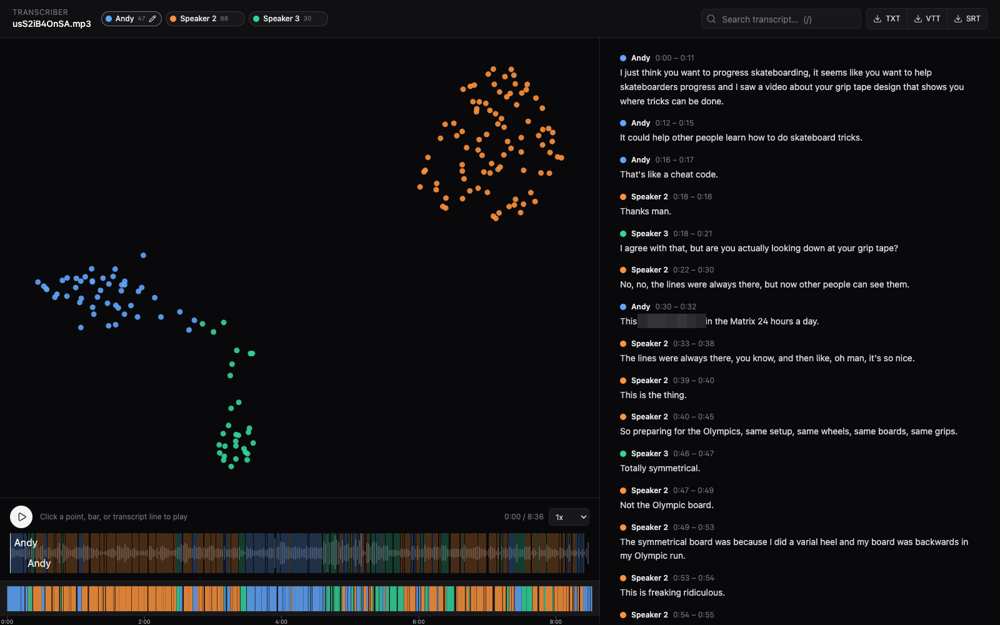

# dialogue-transcriber

**Transcribe conversations and find out who said what.**

[](https://github.com/Novia-RDI-Seafaring/transcriber/actions/workflows/ci.yml)
[](https://pypi.org/project/dialogue-transcriber/)
[](LICENSE)
[](pyproject.toml)

Point it at an interview, panel discussion, meeting recording, or YouTube
URL and get back a transcript where every line is attributed to a speaker —
plus a web UI to inspect the speaker clusters, listen to any segment, and
fix labels by hand.



## How it works

```
audio  ──►  transcribe  ──►  segment  ──►  extract_clips  ──►  embed  ──►  cluster
              (Whisper)        (sentence-       (ffmpeg)       (TitaNet)    (UMAP +
                               level)                                       KMeans +
                                                                            silhouette)
```

Whisper produces word-level timestamps; words are grouped into sentence
segments; each segment's audio is embedded with NVIDIA NeMo TitaNet; the
embeddings are clustered on a UMAP projection; and the transcript comes out
labeled `Speaker 1`, `Speaker 2`, … Every stage is cached on content hash,
so re-runs and config tweaks are cheap.

## Quickstart

`ffmpeg` and `ffprobe` must be on `PATH` (`brew install ffmpeg` on macOS).

```bash
# No install needed:
uvx --from "dialogue-transcriber[all]" transcriber transcribe interview.mp3

# Or install the tool:
uv tool install "dialogue-transcriber[all]"

transcriber transcribe interview.mp3 --participants 2
transcriber transcribe "https://www.youtube.com/watch?v=..." --backend openai
transcriber serve interview.mp3        # review UI on http://127.0.0.1:8000
```

The default backend runs [faster-whisper](https://github.com/SYSTRAN/faster-whisper)
locally; `--backend openai` uses the OpenAI Whisper API instead (requires
`OPENAI_API_KEY`, much faster on machines without a GPU).

### Picking your extras

`[all]` is the easy button. For smaller installs:

```bash
uv pip install dialogue-transcriber              # core only
uv pip install "dialogue-transcriber[local]"     # + faster-whisper backend
uv pip install "dialogue-transcriber[openai]"    # + OpenAI Whisper API backend
uv pip install "dialogue-transcriber[cluster]"   # + scikit-learn / UMAP
uv pip install "dialogue-transcriber[embed]"     # + NeMo TitaNet speaker embedder
uv pip install "dialogue-transcriber[api]"       # + FastAPI backend (powers the web UI)
uv pip install "dialogue-transcriber[youtube]"   # + yt-dlp downloader
uv pip install "dialogue-transcriber[oip]"       # + MCP server for OIP consumers
```

## CLI

```bash
# Full pipeline; writes a speaker-labeled transcript next to the audio
transcriber transcribe path/to/audio.mp3

# Speakers, language, format
transcriber transcribe interview.mp3 --participants 3 --language sv --format vtt

# Machine-readable output on stdout (see "For AI agents" below)
transcriber transcribe interview.mp3 --format json --output -

# Pull audio from YouTube
transcriber download "https://www.youtube.com/watch?v=..."

# Pipeline + web UI
transcriber serve interview.mp3 --participants 3
```

Formats: `txt` (merged speaker turns), `vtt`, `srt`, `json`. Pass
`--context "names, jargon"` to prime Whisper with vocabulary it should
expect. `--output -` streams the transcript to stdout and the summary to
stderr, so the output pipes cleanly.

## Web UI

`transcriber serve` runs a FastAPI backend and serves the bundled React
frontend. You get:

- a UMAP scatter where each dot is one segment, colored by cluster — lasso
  a cluster to bulk-rename it;
- a continuous waveform with one region per segment — click or scrub to
  play anything;
- a Gantt-style speaker timeline;
- a virtualized transcript with full-text search;
- inline-renameable speaker chips (renames persist server-side);
- TXT / VTT / SRT export;
- keyboard navigation (↑/↓ segments, Space play/pause, `/` search).

Multiple jobs can run side by side; add more via the sidebar.

## For AI agents

This project is built to be driven by agents as well as humans.

**Claude Code skill** — the repo doubles as a
[plugin marketplace](https://docs.claude.com/en/docs/claude-code/plugins).
Install the skill and Claude Code will know how to transcribe and diarize
audio on demand:

```
/plugin marketplace add Novia-RDI-Seafaring/transcriber
/plugin install dialogue-transcriber@dialogue-transcriber
```

**Structured output** — `--format json --output -` emits a stable shape on
stdout:

```json
{
  "speakers": ["Speaker 1", "Speaker 2"],
  "n_segments": 42,
  "duration": 512.3,
  "segments": [
    {"speaker": "Speaker 1", "start": 0.0, "end": 4.2, "text": "..."}
  ]
}
```

**MCP / OIP** — the package is an
[Open Ingestion Protocol](https://github.com/Novia-RDI-Seafaring/OIP)
producer, so transcripts can be ingested by any OIP-aware consumer (e.g.
Anchor) with no consumer-side changes:

```bash
transcriber oip install --data-dir ~/transcripts     # register the producer
transcriber oip ingest audio.mp3 --data-dir ~/transcripts
transcriber oip serve                                # MCP server (also: transcriber-mcp)
```

Tool namespace: `transcribe`. Region kind: `transcript_segment`.
`source_ref.kind`: `audio-timestamp`.

## Library use

```python
from transcriber.config import ClusterConfig, PipelineConfig, TranscribeConfig
from transcriber.pipeline import run_pipeline
from transcriber.render import render_txt

cfg = PipelineConfig(
    transcribe=TranscribeConfig(backend="local", language="en"),
    cluster=ClusterConfig(participants=2),
)
result = run_pipeline("interview.mp3", config=cfg)
print(render_txt(result.segments))
```

`PipelineResult.segments` is a list of `SpeakerSegment` records with the
sentence text, time range, the on-disk clip, and the assigned speaker.
`PipelineResult.cluster.projection` is the 2-D UMAP for plotting.

## Backends

| Concern    | Default                                       | Override via                       |
|------------|-----------------------------------------------|-------------------------------------|
| Transcribe | `faster-whisper` large-v3                     | `--backend openai`                  |
| Embed      | `nvidia/speakerverification_en_titanet_large` | pass `embedder=` to `run_pipeline`  |
| Cluster    | UMAP(2) + KMeans + silhouette                 | pass a `ClusterConfig`              |
| YouTube    | `yt-dlp`                                      | replace `YouTubeDownloader`         |

All backends are Protocols — see `transcriber/transcribe/base.py` and
`transcriber/embed/base.py`. Tests use in-memory fakes, so the heavy models
are not required to run the suite.

## Development

```bash
git clone https://github.com/Novia-RDI-Seafaring/transcriber
cd transcriber
uv venv
uv pip install -e ".[dev,cluster,api,openai,embed,youtube]"
(cd web && pnpm install && pnpm build)   # so `transcriber serve` can serve the UI

pytest                  # core + clustering + api tests
pytest -m "not slow"    # skip heavy/network tests
ruff check src tests
```

For frontend work: `cd web && pnpm dev` (http://127.0.0.1:5173, proxies
`/api` to :8000) with `transcriber serve … --port 8000` in another shell.

Releases: publishing a GitHub release triggers
`.github/workflows/release.yml`, which builds the frontend, bundles it into
the wheel, and publishes to PyPI via trusted publishing.

## License

Apache-2.0 — see [LICENSE](LICENSE).
